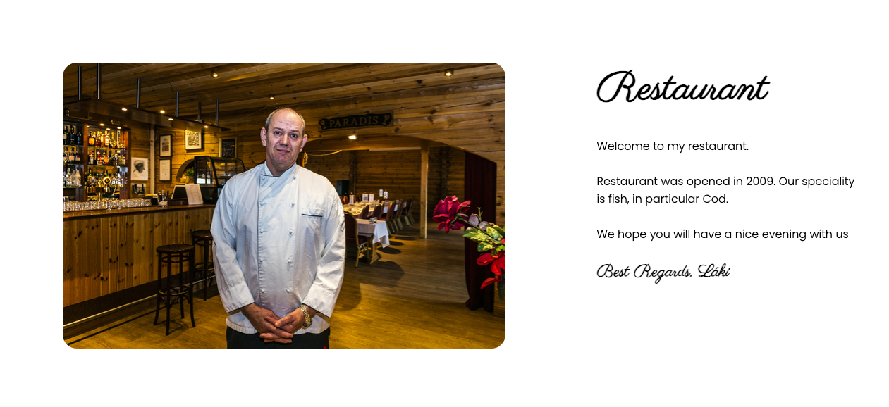

# **_Restaurant_**

Restaurant is a restaurant located in a small fishing village in Grindavik Iceland. It was founded by the owner Láki in 2009. Their speciality is fish courses. Cod in particular. They strive to deliver excellent service and quality food.

Welcome to the journey through <a href="https://johannes2503.github.io/Project-1-Restaurant/" target="_blank" rel="noopener">Restaurant</a>

# Contents

* [**User Experience UX**](<#user-experience-ux>)
    * [Wireframes](<#wireframes>)
    * [Site Structure](<#site-structure>)
    * [Design Choices](<#design-choices>)
    *  [Typography](<#typography>)
    *  [Colour Scheme](<#colour-scheme>)
* [**Features**](<#features>)
    * [**Home**](<#navigation-menu>)
         * [Navigation menu](<#navigation-menu>)
         * [Gallery](<#gallery>)
         * [About-us](<#about-us>)
         * [Testimonials](<#testimonials>)
         * [Footer](<#footer>)
    * [**Projects**](<#projects>)
        * Dolls Cots
        * Height Chart
        * Walker
    * [**Inspiration**](<#inspiration>)
        * Elm
        * Oak
        * Elm
    * [**Contact Us**](<#contact-us>)
       * Contact details
       * Location map
       * Design Query form
    * [**Form Confirmation**](<#form-confirmation>)
    * [**Future Features**](<#future-features>)
* [**Technologies Used**](<#technologies-used>)
* [**Testing**](<#testing>)
* [**Deployment**](<#deployment>)
* [**Credits**](<#credits>)
    * [**Content**](<#content>)
    * [**Media**](<#media>)
*  [**Acknowledgements**](<#acknowledgements>)

# User Experience (UX)

## Wireframes

The wireframes for Restaurant were produced in [Figma](https://figma.com). There are frames for a full width display. The final site varies slightly from the wireframes due to developments that occured during the creation process. 

[Back to top](<#contents>)

## Site Structure

Wawas Woods website has four pages. The [home page](./index.html) is the default loading page, [Menu page](./menu.html), [Reservations](./reservations.html) and [contact](./contact.html) pages are all accessible primarily from the navigation menu.

[Back to top](<#contents>)

## Design Choices

 * ### Typography
      The fonts chosen were 'Parisienne' for the main heading and 'Poppins' for the headings and text. They fall back to cursive and sans-serif respectively. 
     *  ''Parisienne' was chosen for the headings to give the user an inital welcoming feel. The cursive style generally feels more inviting and less intimidating for the user than others.
      * 'Poppins' is used for the body text as it provides a nice contrast to the cursive whilst being easy to read for all.

 * ### Colour Scheme
      The colour scheme eventually chosen is one based on green and off-white. The colour contrasts with the wood colour in many of the images. Green traditionally gives the impression of energy, safety and growth.

[Back to top](<#contents>)

# Features

Restaurants site is set up to be welcoming and easy to use. It contains many features that the user would probably be familiar with, such as a navigation bar and contact form. The overall feel of the website is intended to be inviting and not intimidating to encourage the user to explore further. 

## Existing Features  
  * ### Navigation Menu

    * Sited at the top of all the pages in the site, it is fully responsive and contains links to all the pages of the site to enable ease of navigation in one convenient location.
    * The logo is clickable with a link back to the home page for enhanced UX.

[Back to top](<#contents>)

  * ### Owners Welcome

      * Located on the home page beneath the title section. It is supposed to invite the user to have a enjoyable evening in the good hands of the owner.
      

[Back to top](<#contents>)

  * ### Reviews
    * The reviews section adds to the trust that Restaurant is a place of excellent service and food. 

[Back to top](<#contents>)

* ### Footer
    
    * Contains social media links. To enhance the UX the links open in other tabs.
    * The social media presence will help the user with their research into Restaurant.
    * The footer also contains information about opening hours and contact info.
    

[Back to top](<#contents>)

* ### Menu page
    
    * The menu page contains every course that the restaurant offers.
    * The menu items alternate to be more interesting to the user.

[Back to top](<#contents>)

* ### Reservations page

    * On the reservations page users can order a table at the restaurant.
    * The form askes for information from the user. First name, last name and so on and sends it then on to the restaurant when the user clicks send.
    * The user can pick a date and time from a calendar picker.

[Back to top](<#contents>)

* ### Contact us page

    * On the contact page users can contact the restaurant.
    * The form askes for information from the user. First name, last name and so on and sends it then on to the restaurant when the user clicks send.

[Back to top](<#contents>)

## Future Features 

* A 'Order' section so the user can order takeaway food.
    * This would incorporate an e-commerce platform and an enhanced menu page.
* Introduce swipe actions for use on mobile devices for the menu items sliders.

[Back to top](<#contents>)

# Technologies Used
* [HTML5](https://html.spec.whatwg.org/) - provides the content and structure for the website.
* [CSS](https://www.w3.org/Style/CSS/Overview.en.html) - provides the styling.
* [Figma](https://figma.com) - used to create the wireframes.
* [Gitpod](https://www.gitpod.io/#get-started) - used to deploy the website.
* [Github](https://github.com/) - used to host and edit the website.

[Back to top](<#contents>)

# Testing

## Code Validation
The Restaurant site has be throughly tested. All the code has been run through the [W3C html Validator](https://validator.w3.org/) and the [W3C CSS Validator](https://jigsaw.w3.org/css-validator/). Errors were found on the home and menu pages. After a fix and retest, no errors were returned for both. 

The HTML validator results for each page are below:

* Home page

* Menu page

* Reservations page

* Contact page

The CSS validator results are below:

## Responsiveness Test

* The responsive design tests were carried out manually with [Google Chrome DevTools](https://developer.chrome.com/docs/devtools/) and [Responsive Design Checker](https://www.responsivedesignchecker.com/).

|        | Moto G4 | Galaxy S5 | iPhone 5 | iPad | iPad Pro | Display <1200px | Display >1200px |
|--------|---------|-----------|----------|------|----------|-----------------|-----------------|
| Render | pass    | pass      | pass     | pass | pass     | pass            | pass            |
| Images | pass    | pass      | pass     | pass | pass     | pass            | pass            |
| Links  | pass    | pass      | pass     | pass | pass     | pass            | pass            |

Note: On wide display types the contents of the site are restricted in width to 2000px. This helps the UX by not spreading the content too wide on the extra wide screens.

## Browser Compatibility

Wawas Woods site was tested on the following browsers with no visible issues for the user. 
Google Chrome, Microsoft Edge, Safari and Mozilla Firefox. Appearance, functionality and responsiveness were consistent throughout for a range of device sizes and browsers.

## Testing User Stories

* As a user I want to be able to navigate through the whole site smoothly.
    * Navigation is at the top of every page in the form of the **navigation menu**.
    * In the about us section, there is an additional link to the **contact us** page.
    * On every page there is also a **scroll up arrow** to ease the route to the navigation menu.

     
* As a user I want to understand the purpose of the site upon loading it.
    * On the home page, the heading **'Bespoke wooden designs'** combined with the images in the **gallery** should allow the user to interpolate the main purpose of the site.

     
* As a user I want to easily be able to contact Wawas Woods for more information.
    * On the **contact** page there are contact details. There is also a quick link via an **e-mail icon** to send Wawas Woods an e-mail.
    * On the **contact** page there is also a **form** for ease of contact.

     
* As a user I want to see existing pieces of Wawas Woods' work.
    * On the home page there is the responsive **gallery** section.
    * Additionally one of the pages is the **projects** page. This has images and a brief descripton of the project. and will be updated regularly as projects reach completion.

     
* As a user I want to know more about Wawas Woods.
    * On the home page there is the **about us** section. This gives a brief description on who Wawas Woods are.

     
* As a user I want to know how other peoples' experiences with Wawas Woods have been.
    * At the bottom of the home page there are some **testimonials** from previous customers.

     
* As a user I want to connect with Wawas Woods on social media.
    * In the **footer** of every page there are some **social media links** to Wawas Woods social media pages.

     
* As a user I want to know the process of converting some wood into a finished project.
    * One of the pages is an **inspiration** page. It is designed to give the user an idea of how projects start out and what they could potentially become.
    * On the **inspiration** page there are also simplistic descriptions for the methods of constructing the suggested projects.

## Known Bugs
* ### Resolved

    * During validation two bugs became known during the validation stage, a brief description is below:

    * Home page - 
    
This was an oversight from the development phase when the font size was being modified. It was easily fixed by using the correct closing tag, \</h5>.

    * Inspiration page - 
    
This problem highlighted that the \<UL> was inside the \
 element. It was easily fixed by ensuring that the list was outside of the paragraph.

* ### Unresolved
    * The form, on the face of it acts like you would expect it to, it acknowledges your data input, however the data doesn't push anywhere. This is a limitation within this project and would be rectified for a true deployment of the Wawas Woods site.
    * In the gitpod editor console one problem flags up within the CSS. To enable the site to perform properly on all versions of Safari a 'media query with a blank 'media@' is used. This flags up as an error but infact doesn't affect the sites functionality in its present form. For future development I would link another stylesheet with Safari specific styling to load when Safari is used.
    
    

## Additional Testing
### Lighthouse
The site was also tested using [Google Lighthouse](https://developers.google.com/web/tools/lighthouse) in Chrome Developer Tools to test each of the pages for:
* Performance - How the page performs whilst loading.
* Accessibility - Is the site acccessible for all users and how can it be improved.
* Best Practices - Site conforms to industry best practices.
* SEO - Search engine optimisation. Is the site optimised for search engine result rankings.

As an example the results for Wawas Woods home page are below:

This part of the testing process showed up that the site was slow to load, mainly due to the image sizes. All the images needed to be compressed before adding to the repository. Once this was done the performance went from ~60% to ~90%. 

### Peer review
In addition to the above testing the beta version of the site was put through its paces by peers, both in the software development field and outside. The results highlighted responsive design weakness for a type of mobile device that was rectified with minor CSS amendments. There were also minor spelling and grammar errors that have since been fixed.

Back to [README.md](./README.md#testing).

[Back to top](<#contents>)

# Deployment

### **To deploy the project**
The site was deployed to GitHub pages. The steps to deploy a site are as follows:
  1. In the GitHub repository, navigate to the **Settings** tab.
  2. Once in Settings, navigate to the **Pages** tab on the left hand side.
  3. Under **Source**, select the branch to **master**, then click **save**.
  4. Once the master branch has been selected, the page will be automatically refreshed with a detailed ribbon display to indicate the successful deployment.

  The live link to the Github repository can be found here - https://github.com/EwanColquhoun/wawaswoods

### **To fork the repository on GitHub**
A copy of the GitHub Repository can be made by forking the GitHub account. This copy can be viewed and changes can be made to the copy without affecting the original repository. Take the following steps to fork the repository;
1. Log in to **GitHub** and locate the [repository](https://github.com/EwanColquhoun/wawaswoods).
2. On the right hand side of the page inline with the repository name is a button called **'Fork'**, click on the button to create a copy of the original repository in your GitHub Account.

### **To create a local clone of this project**
The method from cloning a project from GitHub is below:

1. Under the repository’s name, click on the **code** tab.
2. In the **Clone with HTTPS** section, click on the clipboard icon to copy the given URL.

3. In your IDE of choice, open **Git Bash**.
4. Change the current working directory to the location where you want the cloned directory to be made.
5. Type **git clone**, and then paste the URL copied from GitHub.
6. Press **enter** and the local clone will be created.

[Back to top](<#contents>)

# Credits
### Content

* The font came from [Google Fonts](https://fonts.google.com/).
* The map is embedded from [Google Maps](https://www.google.com/maps).
* The colour palate was compiled by [Colormind](http://colormind.io/).
* The icons came from [Font Awesome](https://fontawesome.com/).
* The form validation idea came from a [YouTube tutorial](https://www.youtube.com/watch?v=fNcJuPIZ2WE).
* The code for the Safari specific styling was inspired by an example on [Stack Overflow](https://stackoverflow.com/).
* The inspiration for the Project page sliders came from this repository on [GitHub](https://gist.github.com/zhilinskiy/4603199).
* [Balsamiq](https://balsamiq.com/wireframes/) was used to create the wireframes.

### Media
* The photos all came from the developer, [Ewan Colquhoun](https://www.linkedin.com/in/ewan-colquhoun-2b3535213/).
* The photos were compressed using [Compressor](https://compressor.io/).

[Back to top](<#contents>)

# Acknowledgements
The site was completed as a Portfolio 1 Project piece for the Full Stack Software Developer (e-Commerce) Diploma at the [Code Institute](https://codeinstitute.net/). As such I would like to thank my mentor [Precious Ijege](https://www.linkedin.com/in/precious-ijege-908a00168/), the Slack community, and all at the Code Institute for their help and support. Wawas Woods is a fictional company but it exists in everything but the business title. Currently it is more of a hobby!

Ewan Colquhoun 2021.

[Back to top](<#contents>)